# Branch Backup Action

[](https://github.com/ggfevans/branch-backup-action/blob/main/LICENSE)
[](https://github.com/ggfevans/branch-backup-action/releases)
[](https://github.com/ggfevans/branch-backup-action/actions/workflows/scorecard.yml)

Creates weekly Git branch snapshots with metadata. Originally built for Obsidian vaults, now works with any Git repository.

## Why This Action?

**Never lose your work again.** This action creates automatic, dated snapshots of your repository that serve as recovery points when things go wrong.

### The Problem
- Accidental file deletions or overwrites
- Failed software updates or plugin installations  
- Git operations gone wrong (force pushes, bad merges)
- Sync conflicts in collaborative environments
- Need to recover specific file versions from weeks ago

### The Solution
```
Your Repository
├── main (your active work)
├── main-backup-2025-10-01 (snapshot from Oct 1st)
├── main-backup-2025-10-08 (snapshot from Oct 8th)
└── main-backup-2025-10-15 (snapshot from Oct 15th)
```

**Recovery is simple:**
```bash
git checkout main-backup-2025-10-08  # Jump to any backup
cp important-file.txt ../recovery/   # Extract what you need
git checkout main                    # Return to current work
```

## Who Should Use This?

### Perfect For:
- **Knowledge workers** using Obsidian, Notion, or similar tools
- **Content creators** with valuable documentation and notes
- **Solo developers** working on personal projects
- **Small teams** needing simple backup without complex infrastructure
- **Students and researchers** protecting thesis work and research data
- **Anyone** who values their digital work and wants insurance

### Use Cases:
- Daily note-taking systems (Obsidian, Roam Research)
- Personal websites and blogs
- Configuration repositories (dotfiles)
- Small to medium codebases
- Documentation sites
- Creative writing projects
- Research and academic work

**Personal project shared as-is.** Limited support, forks welcome.

## How It Works

```mermaid
flowchart TD
    A["Schedule Trigger<br/>(Sunday 00:00 UTC)"] --> B["📥 Checkout Repository"]
    B --> C["Get Current Commit"]
    C --> D["Collect Metadata<br/>(commits, contributors, files)"]
    D --> E["Create Backup Branch<br/>{branch}-backup-YYYY-MM-DD"]
    E --> F["Create Annotated Tag<br/>with metadata"]
    F --> G["Push Branch & Tag"]
    G --> H["Generate Summary"]
    G --> I["Create Issue<br/>(on failure only)"]
```



**Result:** Your repository gets a permanent snapshot with rich metadata, accessible as a regular Git branch.

## What It Does

- **Automated backups**: Creates `{branch}-backup-YYYY-MM-DD` branches every Sunday at midnight UTC
- **Rich metadata**: Annotated tags with commit statistics (commits, contributors, files changed)
- **Failure handling**: Creates GitHub issues automatically when backup fails
- **Manual triggers**: Run backups on-demand via the Actions tab
- **Permanent retention**: Keeps all backups indefinitely for maximum safety
- **Branch naming**: Includes source branch name for easy identification

## Usage

### Option 1: Use the Action Directly

Add to `.github/workflows/backup.yml`:

```yaml
name: Weekly Backup
on:
  schedule:
    - cron: '0 0 * * 0'  # Every Sunday at midnight UTC
  workflow_dispatch:

jobs:
  backup:
    runs-on: ubuntu-latest
    permissions:
      contents: write
      issues: write
    steps:
      - uses: ggfevans/branch-backup-action@v1
```

Creates branches named `{branch}-backup-YYYY-MM-DD` with annotated tags. Manual trigger available in Actions tab.

### Option 2: Use as Template

If you prefer to have your own copy for customization:

1. Click **[Use this template](https://github.com/ggfevans/branch-backup-action/generate)** to create your own repository
2. Modify `action.yml` and documentation as needed
3. Reference your custom action: `uses: YOUR_USERNAME/branch-backup-action@main`

This gives you full control to customize the backup logic, scheduling, or metadata collection.

## Personal Access Token Setup

This action requires a [fine-grained personal access token](https://docs.github.com/en/authentication/keeping-your-account-and-data-secure/managing-your-personal-access-tokens#creating-a-fine-grained-personal-access-token) with specific permissions to create branches and tags.

### Required Permissions

The token must have access to your repository with these permissions:

- **Metadata**: Read access
- **Contents**: Read and Write access
- **Pull requests**: Read and Write access  
- **Actions**: Read and Write access

### Setup Steps

1. Go to [GitHub Settings > Developer settings > Personal access tokens > Fine-grained tokens](https://github.com/settings/personal-access-tokens/new)
2. Click **Generate new token**
3. **Token name**: Enter a descriptive name (e.g., "Branch Backup Action")
4. **Expiration**: Set expiration (or "No expiration" if allowed by your organization)
5. **Resource owner**: Select the account/organization that owns your repository
6. **Repository access**: Select "Selected repositories" and choose your target repository
7. **Permissions**: Under "Repository permissions", set:
   - **Metadata**: Read
   - **Contents**: Read and write
   - **Pull requests**: Read and write
   - **Actions**: Read and write
8. Click **Generate token**
9. Copy the token immediately (you won't see it again)

### Using the Token

**Option 1 - Default (Recommended):**
Use the built-in `GITHUB_TOKEN` with proper workflow permissions (as shown in the usage example above).

**Option 2 - Custom Token:**
If you need a custom token, add it to your repository secrets and reference it:

```yaml
steps:
  - uses: ggfevans/branch-backup-action@v1
    with:
      github-token: ${{ secrets.BACKUP_TOKEN }}
```

### Security Notes

- Fine-grained tokens are more secure than classic tokens
- Only grant the minimum required permissions
- Set reasonable expiration dates
- Store tokens in repository secrets, never in code
- All action dependencies are pinned to full commit SHAs for supply chain security

## For Obsidian Users

Protects against accidental deletions, sync conflicts, and failed plugin updates:

```bash
git checkout main-backup-2025-09-29  # Restore from backup
git checkout main                    # Return to current
```

## Comparison to Alternatives

| Solution | Setup Complexity | Cost | Automation | Recovery Speed | Repository Integration |
|----------|------------------|------|------------|----------------|-----------------------|
| **This Action** | Low (5 min setup) | Free | Full | Fast | Native Git branches |
| Obsidian Git Plugin | Medium | Free | Limited | Medium | Local Git only |
| Obsidian Sync | Low | $10/month | Full | Fast | Proprietary format |
| Manual Git backups | High | Free | None | Slow | Manual branches |
| Cron + Git scripts | High | Free | Custom | Medium | Custom implementation |
| Cloud storage sync | Low | $5-15/month | File-level only | Medium | External files |

### Why Choose This Action?
- **Zero maintenance**: Set up once, works forever
- **GitHub native**: Uses familiar Git branches and tags
- **Rich metadata**: Tracks contributors, commit counts, file changes
- **Failure alerts**: Creates GitHub issues when something goes wrong
- **No external dependencies**: Pure GitHub Actions, no third-party services
- **Transparent operation**: All backup logic is visible and auditable

## Configuration

```yaml
- uses: ggfevans/branch-backup-action@v1
  with:
    backup-prefix: 'snapshot'     # Default: 'backup'
    branch-to-backup: 'develop'   # Default: 'main'
```

Change schedule:
```yaml
cron: '0 0 * * 1'  # Every Monday instead of Sunday
```

## Storage Policy

**This action intentionally keeps all backups indefinitely.** We do not automatically delete any backup branches or tags due to the inherent risk of data loss.

### Why No Automatic Cleanup?

- **Safety first**: Backups are worthless if they're accidentally deleted
- **Storage is cheap**: Git branches and tags are lightweight references
- **You decide**: Only you know which backups are safe to remove
- **Recovery priority**: Better to have too many backups than too few

### Repository Size Considerations

GitHub recommends staying within [repository size limits](https://docs.github.com/en/repositories/creating-and-managing-repositories/repository-limits#repository-size) for optimal performance:

- **Repository size**: 10GB on-disk size (.git folder) recommended maximum
- **Branch limit**: 5,000 branches maximum (this action creates ~52 branches per year)
- **Performance impact**: Large repositories can slow fetch operations and increase clone times

Since this action creates one branch per week, you'll have approximately 52 backup branches per year, which is well within GitHub's limits. Monitor your repository size periodically if you have a large codebase.

### Manual Cleanup (Optional)

If you need to manage storage, you can manually delete old backups:
```bash
git push origin --delete main-backup-2025-01-01
git push origin --delete refs/tags/main-backup-2025-01-01
```

Bulk cleanup scripts in [docs/STORAGE.md](docs/STORAGE.md).

## Success Stories

### Real-World Recovery Scenarios

**"Saved my thesis"** - *Graduate student*
> "Two weeks before my defense, a sync conflict corrupted three chapters of my thesis. I was able to recover everything from a backup branch created just days before. This action literally saved months of work."

**"Plugin disaster recovery"** - *Obsidian power user*
> "An Obsidian plugin update went wrong and deleted half my daily notes. Within 5 minutes, I had restored my entire vault from last week's backup. Now I sleep better knowing my 3 years of notes are protected."

**"Git rebase gone wrong"** - *Solo developer*
> "I completely messed up an interactive rebase and lost two days of commits. The backup branch from Sunday had everything I needed. Saved me from recreating work I'd already done."

### Common Recovery Patterns

**Selective file recovery:**
```bash
git show main-backup-2025-10-01:path/to/file.txt > recovered-file.txt
```

**Compare changes over time:**
```bash
git diff main-backup-2025-10-01..main-backup-2025-10-08 -- important-file.txt
```

**Full restore point:**
```bash
git checkout main-backup-2025-10-01
git checkout -b recovery-branch  # Work from backup
```

### Why Users Choose This Over Alternatives

- **"It just works"** - Set up once in 2024, still running perfectly in 2025
- **"No subscription fatigue"** - Free forever, no monthly charges adding up
- **"Familiar tools"** - Uses Git commands everyone already knows
- **"Visible history"** - Can see exactly what was backed up and when
- **"No vendor lock-in"** - Standard Git branches work with any Git client

## Troubleshooting

- Enable Actions in repository settings
- Ensure workflow has `contents: write` and `issues: write` permissions
- See [docs/TROUBLESHOOTING.md](docs/TROUBLESHOOTING.md)

## AI Assistance Acknowledgment

This project uses AI tools (Claude, GitHub Copilot) as development aids while maintaining full human oversight. All code, decisions, and releases are human-controlled. See [AI_ACKNOWLEDGMENT.md](AI_ACKNOWLEDGMENT.md) for details.

## License

MIT - see [LICENSE](LICENSE)
